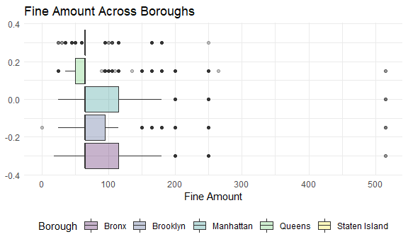
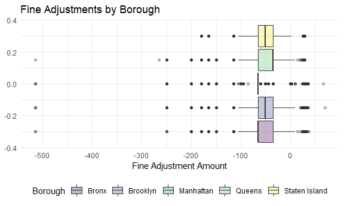

fines
================
Waveley Qiu (wq2162)
2021-12-03

## Mean Fine Amount Across Boroughs

First, let us compute the average fine amounts across the different
boroughs:

``` r
violation %>%
  group_by(borough) %>%
  summarise(
    avg_fine = mean(fine_amount)
  )
```

    ## # A tibble: 5 x 2
    ##   borough       avg_fine
    ##   <chr>            <dbl>
    ## 1 Bronx             76.5
    ## 2 Brooklyn          74.4
    ## 3 Manhattan         82.3
    ## 4 Queens            68.4
    ## 5 Staten Island     66.9

We observe that the average fine amount is highest in Manhattan and
lowest in Staten Island.

``` r
violation %>% group_by(borough) %>% 
  ggplot(aes(x = fine_amount, fill = borough)) + 
  geom_boxplot(alpha = 0.3) +
  labs(
    x = "Fine Amount",
    fill = "Borough",
    title = "Fine Amount Across Boroughs"
  )
```



To see if fine amounts do differ significantly across boroughs, we will
conduct a simple one-way ANOVA on these two variables.

``` r
violation_reg <- lm(fine_amount~borough, data = violation)
anova(violation_reg)
```

    ## Analysis of Variance Table
    ## 
    ## Response: fine_amount
    ##                Df     Sum Sq  Mean Sq F value    Pr(>F)    
    ## borough         4   48062653 12015663   17148 < 2.2e-16 ***
    ## Residuals 1770798 1240813885      701                      
    ## ---
    ## Signif. codes:  0 '***' 0.001 '**' 0.01 '*' 0.05 '.' 0.1 ' ' 1

There appear to be differences between fine amounts and at least 2
boroughs.

## Which borough tends to pay the most in excess fees?

Now, we will investigate tendencies in amounts paid in excess of the
baseline fine amount.

``` r
violation %>%
  select(borough, contains("amount")) %>%
  mutate(
    net_total_amount = fine_amount + penalty_amount + interest_amount - reduction_amount,
    excess_amount = penalty_amount + interest_amount - reduction_amount
  ) %>%
  group_by(borough) %>%
  summarise(
    avg_excess_amount = mean(excess_amount),
    avg_net_total_amount = mean(net_total_amount),
    avg_total_amount = mean(fine_amount)
  )
```

    ## # A tibble: 5 x 4
    ##   borough       avg_excess_amount avg_net_total_amount avg_total_amount
    ##   <chr>                     <dbl>                <dbl>            <dbl>
    ## 1 Bronx                     -5.09                 71.4             76.5
    ## 2 Brooklyn                  -5.56                 68.8             74.4
    ## 3 Manhattan                 -7.23                 75.1             82.3
    ## 4 Queens                    -6.79                 61.6             68.4
    ## 5 Staten Island             -6.85                 60.0             66.9

It seems that parking violation fine adjustments are typically reduced,
not increased, if the fine is adjusted.

``` r
violation %>%
  select(borough, contains("amount")) %>%
  mutate(
    excess_amount = penalty_amount + interest_amount - reduction_amount
  ) %>%
  filter(excess_amount !=  0) %>%
  
  ggplot(aes(x = excess_amount, fill = borough)) +
  geom_boxplot(alpha = 0.3) +
  labs(
    x = "Fine Adjustment Amount",
    fill = "Borough",
    title = "Fine Adjustments by Borough"
  )
```


