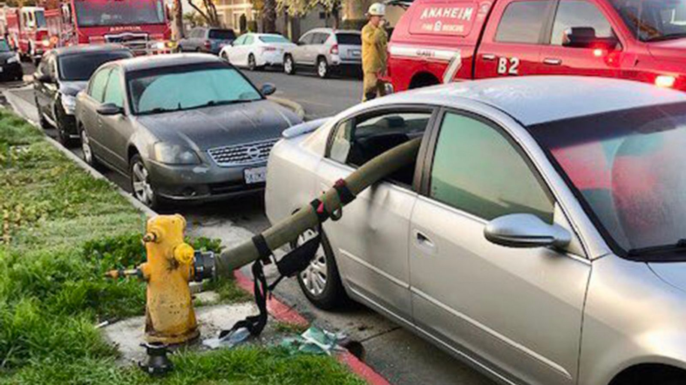

&nbsp;

### Introduction
One of our group members' had the unfortunate experience of getting her car towed last year, due to parking near by a fire hydrant in Minnesota. A news report published by New York Post about locations drivers were most likely to get a parking ticket in NYC between October 2020 and September 2021 [-Link]( https://nypost.com/2021/11/18/these-are-the-worst-nyc-streets-for-getting-a-parking-ticket/). We were intrigued by the potential of investigating the parking violation in NYC in 2021. 

&nbsp;

### Website Overview
In the exploratory analyses section, you will find:

* Visualization of frequency of violation and violation type

* Violation over day, weekday, and month

* Analyses of fine amount 

* Violation by vehicle types

* Map showing the location of violation and number of violation in each county

In the statistical analyses section, you will find:

* Anova Test - Whether month and weekday are associated with parking violations

* Chi-squared Test - whether the violation types vary among boroughs

* Proportion Test - whether proportions of the population receiving fire hydrant violations in each borough are equal

In hydrant mapping tab, you will find:

* Mapping of hydrant 

* Mapping of hydrant tickets

Visit the [Project Report](final_report.html) for the details of our project!

&nbsp;

### Collaborators

Waveley Qiu (wq2162)

Haotian Wu (hw2849)

Yan Wang (yw3773)

Yuanyuan Zeng (yz4181)

Dantong Zhu (dz2451)

