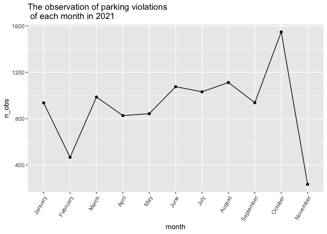
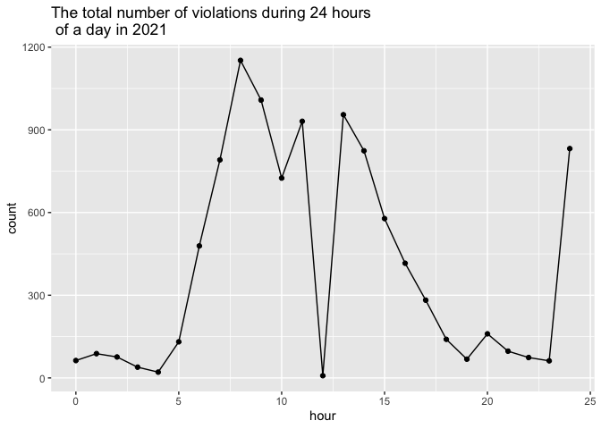
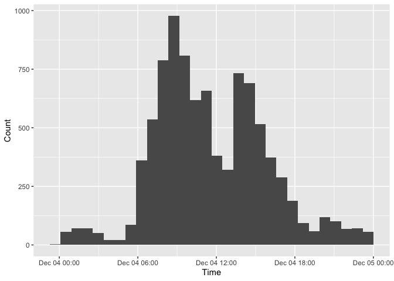

timeline
================
Sarah

``` r
library(tidyverse)
```

    ## ── Attaching packages ─────────────────────────────────────── tidyverse 1.3.1 ──

    ## ✓ ggplot2 3.3.5     ✓ purrr   0.3.4
    ## ✓ tibble  3.1.4     ✓ dplyr   1.0.7
    ## ✓ tidyr   1.1.3     ✓ stringr 1.4.0
    ## ✓ readr   2.0.1     ✓ forcats 0.5.1

    ## ── Conflicts ────────────────────────────────────────── tidyverse_conflicts() ──
    ## x dplyr::filter() masks stats::filter()
    ## x dplyr::lag()    masks stats::lag()

``` r
library(ggplot2)

source("code/data_cleaning.R")
```

    ## 
    ## Attaching package: 'lubridate'

    ## The following objects are masked from 'package:base':
    ## 
    ##     date, intersect, setdiff, union

    ## 
    ## Attaching package: 'plotly'

    ## The following object is masked from 'package:httr':
    ## 
    ##     config

    ## The following object is masked from 'package:ggplot2':
    ## 
    ##     last_plot

    ## The following object is masked from 'package:stats':
    ## 
    ##     filter

    ## The following object is masked from 'package:graphics':
    ## 
    ##     layout

    ## Rows: 1770806 Columns: 19

    ## ── Column specification ────────────────────────────────────────────────────────
    ## Delimiter: ","
    ## chr (12): Plate, State, License Type, Issue Date, Violation Time, Violation,...
    ## dbl  (7): Summons Number, Fine Amount, Penalty Amount, Interest Amount, Redu...

    ## 
    ## ℹ Use `spec()` to retrieve the full column specification for this data.
    ## ℹ Specify the column types or set `show_col_types = FALSE` to quiet this message.

    ## Rows: 5346917 Columns: 43

    ## ── Column specification ────────────────────────────────────────────────────────
    ## Delimiter: ","
    ## chr (25): Plate ID, Registration State, Plate Type, Issue Date, Vehicle Body...
    ## dbl (14): Summons Number, Violation Code, Street Code1, Street Code2, Street...
    ## lgl  (4): Violation Legal Code, No Standing or Stopping Violation, Hydrant V...

    ## 
    ## ℹ Use `spec()` to retrieve the full column specification for this data.
    ## ℹ Specify the column types or set `show_col_types = FALSE` to quiet this message.

``` r
source("code/formatting.R")

head(violation)
```

    ## # A tibble: 6 × 24
    ##   plate   state license_type summons_number issue_date violation_time violation 
    ##   <chr>   <chr> <chr>                 <dbl> <date>     <chr>          <chr>     
    ## 1 JEE8350 NY    PAS              8862907229 2020-01-24 07:00A         NO STANDI…
    ## 2 HKK8446 NY    PAS              8867960453 2020-01-11 01:33P         REG. STIC…
    ## 3 JRC3163 NY    PAS              8870051213 2020-01-13 08:32A         SAFETY ZO…
    ## 4 EGR6172 NY    PAS              8839975706 2020-01-13 08:22A         NO PARKIN…
    ## 5 JGN2665 NY    PAS              8753698708 2020-01-08 08:08A         NO STANDI…
    ## 6 JRA8048 NY    PAS              8801437286 2020-01-19 02:08P         NO STANDI…
    ## # … with 17 more variables: judgment_entry_date <chr>, fine_amount <dbl>,
    ## #   penalty_amount <dbl>, interest_amount <dbl>, reduction_amount <dbl>,
    ## #   payment_amount <dbl>, amount_due <dbl>, precinct <chr>, borough <chr>,
    ## #   issuing_agency <chr>, violation_status <chr>, summons_image <chr>,
    ## #   weekday <chr>, year <dbl>, month <dbl>, day <int>, address <chr>

This plot shows the overall parking violations each month in 2020.

``` r
violation %>%
  mutate(month = month.name[as.numeric(month)]) %>%
  mutate(month = as.factor(month),
         month = fct_relevel(month, "January", "February", "March", "April", "May", "June", "July", "August", "September", "October", "November", "December")) %>%
  relocate(month) %>%
  group_by(month) %>%
  summarize(n_obs = n()) %>%
  ggplot(aes(x = month, y = n_obs, group = 1)) + 
  geom_point() + geom_line() + 
  theme(axis.text.x = element_text(angle = 60, hjust = 1) ) +
  labs(title = "The observation of parking violations \n of each month in 202")
```


``` r
violation %>%
  mutate(month = month.name[as.numeric(month)]) %>%
  mutate(month = as.factor(month),
         month = fct_relevel(month, "January", "February", "March", "April", "May", "June", "July", "August", "September", "October", "November", "December")) %>%
  relocate(month) %>%
  mutate(month = "November") %>%
  group_by(month, day) %>%
  summarize(n_obs = n()) %>%
  ggplot(aes(x = day, y = n_obs, group = 1)) + 
  geom_point() + geom_line() + 
  theme(axis.text.x = element_text(angle = 60, hjust = 1) ) +
  labs(title = "The observation of parking violations \n of each month in 202")
```

    ## `summarise()` has grouped output by 'month'. You can override using the `.groups` argument.



It seems like there is a weekly pattern.

``` r
violation %>% 
  group_by(weekday) %>%
  mutate(weekday = as.factor(weekday)) %>%
  mutate(weekday = fct_relevel(weekday, "Monday", "Tuesday", "Wednesday", "Thurday", "Friday")) %>%
  summarize(n_obs = n()) %>%
  ggplot(aes(x = weekday, y = n_obs, group = 1)) + 
  geom_point() + geom_line() + 
  theme(axis.text.x = element_text(angle = 60, hjust = 1) ) +
  labs(title = "ddd")
```

    ## Warning: Unknown levels in `f`: Thurday

    ## Warning: Unknown levels in `f`: Thurday

    ## Warning: Unknown levels in `f`: Thurday

    ## Warning: Unknown levels in `f`: Thurday

    ## Warning: Unknown levels in `f`: Thurday

    ## Warning: Unknown levels in `f`: Thurday

    ## Warning: Unknown levels in `f`: Thurday



``` r
plot_timeline_day = 
  violation %>%
  separate(violation_time, c("hour", "min"), ":") %>%
  mutate(hour = ifelse(substr(min, 3, 3) == "P", as.numeric(hour) + 12, hour)) %>%
  mutate(hour = as.numeric(hour)) %>%
  group_by(hour) %>%
  summarize(count = n()) %>%
  filter(hour <= 24)

plot_timeline_day %>%
  ggplot(aes(x = hour, y = count)) + geom_point() + geom_line() +
  labs(title = "The total number of violations during 24 hours \n of a day in 2020")
```



8:00 seems to have the highest number of parking violations.

``` r
plot_timeline_day = 
  violation %>%
  mutate(weekday == "Monday") %>%
  separate(violation_time, c("hour", "min"), ":") %>%
  mutate(hour = ifelse(substr(min, 3, 3) == "P", as.numeric(hour) + 12, hour)) %>%
  mutate(hour = as.numeric(hour)) %>%
  group_by(hour) %>%
  summarize(count = n()) %>%
  filter(hour <= 24)

plot_timeline_day %>%
  ggplot(aes(x = hour, y = count)) + geom_point() + geom_line() +
  labs(title = "The total number of violations during 24 hours \n of every Monday in 2020")
```


