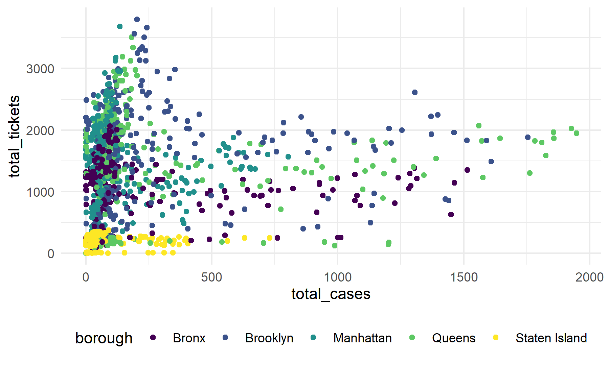
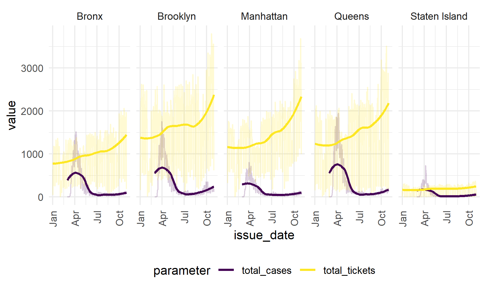

parking\_covid
================
Waveley Qiu (wq2162)
12/6/2021

``` r
url <- "https://raw.githubusercontent.com/nychealth/coronavirus-data/master/trends/data-by-day.csv"

covid <- 
  read_csv(url(url)) %>%
  janitor::clean_names() %>%
  select(date_of_interest, bx_case_count, mn_case_count, si_case_count, qn_case_count, bk_case_count) %>%
  pivot_longer(
    cols = bx_case_count:bk_case_count,
    names_to = "borough",
    values_to = "total_cases"
  ) %>%
  mutate(
    borough_abbr = str_replace(borough, "_case_count", ""),
    borough = 
      case_when(
      borough_abbr == "bx" ~ "Bronx",
      borough_abbr == "bk" ~ "Brooklyn",
      borough_abbr == "mn" ~ "Manhattan",
      borough_abbr == "qn" ~ "Queens",
      borough_abbr == "si" ~ "Staten Island"
    ),
    date_of_interest = as.Date(date_of_interest, "%m/%d/%Y")
  ) 
```

    ## Rows: 645 Columns: 67

    ## -- Column specification --------------------------------------------------------
    ## Delimiter: ","
    ## chr  (1): date_of_interest
    ## dbl (66): CASE_COUNT, PROBABLE_CASE_COUNT, HOSPITALIZED_COUNT, DEATH_COUNT, ...

    ## 
    ## i Use `spec()` to retrieve the full column specification for this data.
    ## i Specify the column types or set `show_col_types = FALSE` to quiet this message.

``` r
violation_covid <-
  violation %>% 
  count(issue_date, borough) %>%
  rename(total_tickets = n) %>%
  left_join(covid, by = c("issue_date" = "date_of_interest", "borough")) 

violation_covid_long <-
  violation_covid %>%
  pivot_longer(
    cols = total_tickets:total_cases,
    names_to = "parameter",
    values_to = "value"
  )
```

Here is a plot of total tickets against total cases, irrespective of
issue date, and colored by borough:

``` r
violation_covid %>%
  ggplot(aes(x = total_cases, y = total_tickets, col = borough)) +
  geom_point()
```

    ## Warning: Removed 295 rows containing missing values (geom_point).



``` r
violation_covid_long %>% 
  ggplot(aes(x = issue_date, y = value, col = parameter)) +
  geom_line(alpha = 0.2) + 
  geom_smooth(se = FALSE) +
  xlim(c(as.Date("01-01-2021", "%m/%d/%Y"), as.Date("11-21-2021", "%m/%d/%Y"))) +
  theme(axis.text.x = element_text(angle = 90, vjust = 0.5, hjust = 1)) +
  facet_grid(. ~ borough) 
```

    ## `geom_smooth()` using method = 'loess' and formula 'y ~ x'

    ## Warning: Removed 295 rows containing non-finite values (stat_smooth).

    ## Warning: Removed 59 row(s) containing missing values (geom_path).



We will now perform a Granger-causality test to see if knowing the
previous day’s number of COVID-19 cases is helpful in predicting the
number of parking violations given out. We will perform this test at an
*α* = 0.05 significance level.

``` r
grangertest(total_tickets ~ total_cases, order = 1, data = violation_covid)
```

    ## Granger causality test
    ## 
    ## Model 1: total_tickets ~ Lags(total_tickets, 1:1) + Lags(total_cases, 1:1)
    ## Model 2: total_tickets ~ Lags(total_tickets, 1:1)
    ##   Res.Df Df      F    Pr(>F)    
    ## 1   1222                        
    ## 2   1223 -1 22.867 1.947e-06 ***
    ## ---
    ## Signif. codes:  0 '***' 0.001 '**' 0.01 '*' 0.05 '.' 0.1 ' ' 1

As the test’s p-value is less than our predetermined significance level
of 0.05, we reject the null hypothesis that
