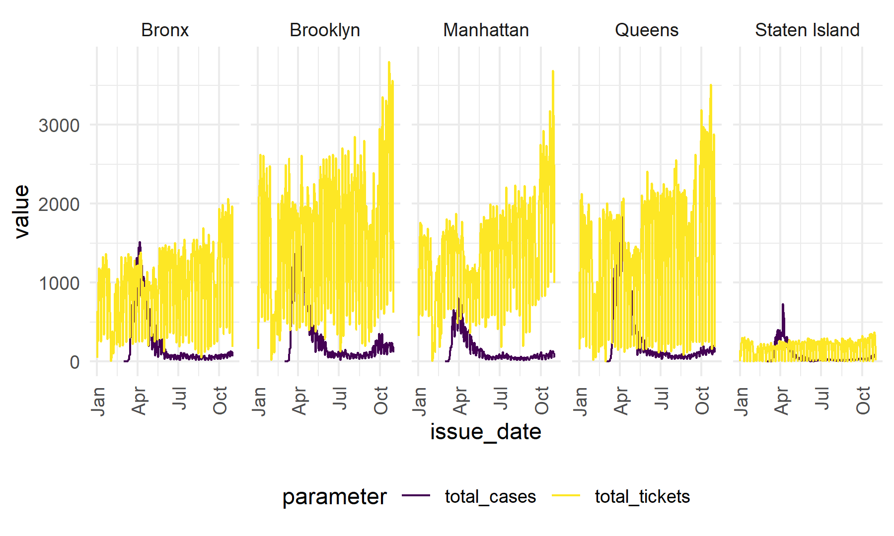

parking\_covid
================
Waveley Qiu (wq2162)
12/6/2021

``` r
url <- "https://raw.githubusercontent.com/nychealth/coronavirus-data/master/trends/data-by-day.csv"

covid <- 
  read_csv(url(url)) %>%
  janitor::clean_names() %>%
  select(date_of_interest, bx_case_count, mn_case_count, si_case_count, qn_case_count, bk_case_count) %>%
  pivot_longer(
    cols = bx_case_count:bk_case_count,
    names_to = "borough",
    values_to = "total_cases"
  ) %>%
  mutate(
    borough_abbr = str_replace(borough, "_case_count", ""),
    borough = 
      case_when(
      borough_abbr == "bx" ~ "Bronx",
      borough_abbr == "bk" ~ "Brooklyn",
      borough_abbr == "mn" ~ "Manhattan",
      borough_abbr == "qn" ~ "Queens",
      borough_abbr == "si" ~ "Staten Island"
    ),
    date_of_interest = as.Date(date_of_interest, "%m/%d/%Y")
  ) %>%
  filter(date_of_interest <= Sys.Date())
```

    ## Rows: 644 Columns: 67

    ## -- Column specification --------------------------------------------------------
    ## Delimiter: ","
    ## chr  (1): date_of_interest
    ## dbl (66): CASE_COUNT, PROBABLE_CASE_COUNT, HOSPITALIZED_COUNT, DEATH_COUNT, ...

    ## 
    ## i Use `spec()` to retrieve the full column specification for this data.
    ## i Specify the column types or set `show_col_types = FALSE` to quiet this message.

``` r
violation_covid <-
  violation %>% 
  count(issue_date, borough) %>%
  rename(total_tickets = n) %>%
  left_join(covid, by = c("issue_date" = "date_of_interest", "borough")) %>%
  pivot_longer(
    cols = total_tickets:total_cases,
    names_to = "parameter",
    values_to = "value"
  )

violation_covid %>% 
  ggplot(aes(x = issue_date, y = value, col = parameter)) +
  geom_line(alpha = 0.2) + 
  geom_smooth(se = FALSE) +
  theme(axis.text.x = element_text(angle = 90, vjust = 0.5, hjust = 1)) +
  facet_grid(. ~ borough) 
```

    ## `geom_smooth()` using method = 'loess' and formula 'y ~ x'

    ## Warning: Removed 35 rows containing non-finite values (stat_smooth).


